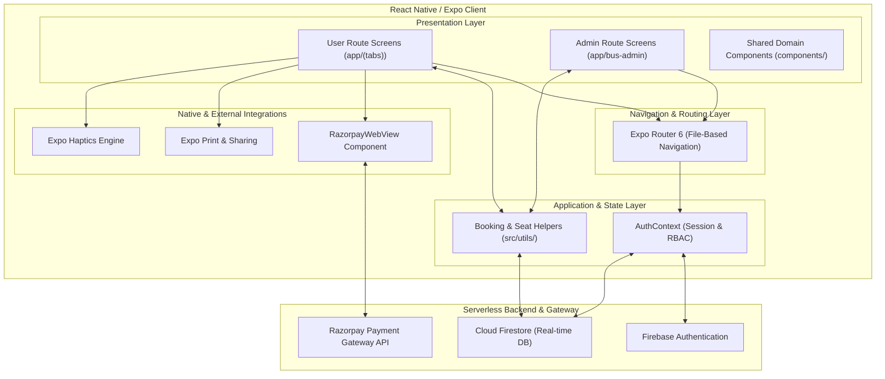
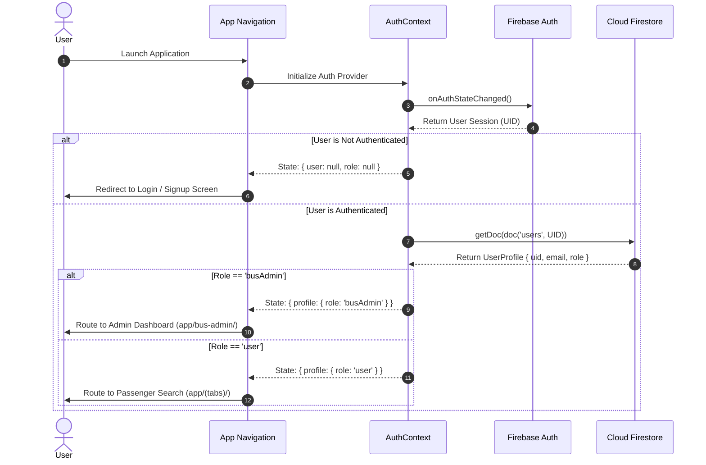
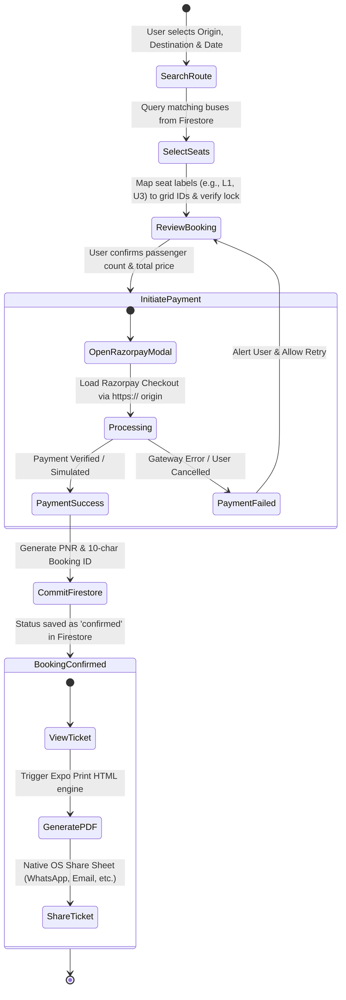

# Go Bus 🚌


**Go Bus** is a production-grade, mobile-first bus ticket booking and fleet management platform built with **Expo SDK 54**, **React Native 0.81**, and **TypeScript**. Designed with an enterprise-level architecture, it features real-time seat synchronization via **Firebase Cloud Firestore**, secure in-app payment processing via **Razorpay**, on-device PDF ticket generation, and role-based access control (RBAC) separating passengers from bus operators.

---

## 📋 Table of Contents

- [Key Features](#-key-features)
  - [Passenger (User) Workflow](#passenger-user-workflow)
  - [Bus Operator (Admin) Workflow](#bus-operator-admin-workflow)
- [System Architecture](#-system-architecture)
  - [High-Level Architectural Overview](#high-level-architectural-overview)
  - [Role-Based Access Control (RBAC) Flow](#role-based-access-control-rbac-flow)
  - [Booking & Payment Lifecycle Flow](#booking--payment-lifecycle-flow)
- [Data Models & Schema Design](#-data-models--schema-design)
  - [Users Collection (`users`)](#1-users-collection-users)
  - [Buses Collection (`buses`)](#2-buses-collection-buses)
  - [Bookings Collection (`bookings`)](#3-bookings-collection-bookings)
- [Technical Deep-Dive](#-technical-deep-dive)
  - [Interactive Seat Mapping & Collision Prevention](#interactive-seat-mapping--collision-prevention)
  - [Razorpay Payment Integration & Simulation](#razorpay-payment-integration--simulation)
  - [On-Device PDF Ticket Engine](#on-device-pdf-ticket-engine)
  - [Haptics & Micro-Interactions](#haptics--micro-interactions)
- [Project Directory Structure](#-project-directory-structure)
- [Getting Started](#-getting-started)
  - [Prerequisites](#prerequisites)
  - [Installation & Setup](#installation--setup)
  - [Running the App Locally](#running-the-app-locally)
- [Build & Deployment (EAS)](#-build--deployment-eas)
- [Troubleshooting & FAQs](#-troubleshooting--faqs)
- [License](#-license)

---

## 🌟 Key Features

### Passenger (User) Workflow
- **Real-Time Route & Date Discovery**: Search buses by origin, destination, and travel dates with instant Firestore querying and filtering.
- **Interactive Visual Seat Selection**: Dual-deck (Lower/Upper) grid layout supporting sleeper and seater configurations. Booked seats are dynamically locked in real time to prevent double-booking.
- **Secure Payment Gateway**: Seamless in-app checkout powered by Razorpay in a secure modal WebView, complete with a fallback simulation mode for development and testing.
- **Instant Booking Confirmation & PNR Generation**: Generates unique 10-character Booking IDs and 6-character PNR codes upon successful payment transaction.
- **On-Device PDF Ticket Generation**: Converts booking details into professional, printable HTML tickets converted to PDF and shared via native iOS/Android sharing sheets using `expo-print` and `expo-sharing`.
- **Booking Lifecycle Management**: Track active, upcoming, and past trips with self-service booking cancellation and status updates.

### Bus Operator (Admin) Workflow
- **Fleet Registration Portal**: Comprehensive form interface to onboard new vehicles with custom departure/arrival times, meridiems, route stops, pricing tiers, and total seat capacities.
- **Live Fleet Monitoring**: Real-time overview of active buses, occupancy rates, and revenue metrics.
- **Manifest & Passenger Management**: Drill down into individual buses to view confirmed passenger manifests, assigned seat numbers, and contact details.
- **Route & Vehicle Modification**: Edit existing bus schedules, update ticket prices, or decommission buses on the fly.

---

## 🏗 System Architecture

### High-Level Architectural Overview

The application follows a clean **Layered Architecture** leveraging **Expo Router 6** for file-based navigation, React Context for state encapsulation, and Firebase Cloud Services for serverless backend operations and real-time data persistence.



### Role-Based Access Control (RBAC) Flow

Authentication and role resolution are handled centrally within `AuthContext.tsx`. Upon login or token refresh, the context inspects the user's Firestore profile document to determine their operational role (`user` vs `busAdmin`) and enforces layout-level route protection.



### Booking & Payment Lifecycle Flow

When a user initiates a booking, the system guarantees data consistency by verifying seat availability, orchestrating payment validation, and committing the transaction atomic-style to Firestore.



---

## 🗄 Data Models & Schema Design

The application relies on three core NoSQL collections in **Cloud Firestore**. Below are the formal TypeScript interfaces and schema descriptions governing each entity.

### 1. Users Collection (`users`)
Stores profile metadata and role definitions for every authenticated user. Document ID corresponds directly to the Firebase Auth `uid`.

```typescript
export type UserRole = 'user' | 'busAdmin';

export interface UserProfile {
  uid: string;           // Primary Key: Matches Firebase Authentication UID
  name: string;          // Full display name of the user or operator
  email: string;         // Primary contact email (normalized to lowercase)
  role: UserRole;        // RBAC Discriminator: 'user' | 'busAdmin'
  createdAt: string;     // ISO 8601 Timestamp of account creation
}
```

### 2. Buses Collection (`buses`)
Represents the fleet registry managed by bus operators. Contains scheduling, route stops, vehicle specifications, and pricing.

```typescript
export type BusType = 'AC Sleeper' | 'AC Seater' | 'Non-AC Sleeper' | 'Non-AC Seater';
export type Meridiem = 'AM' | 'PM';

export interface BusDocument {
  id?: string;               // Firestore Auto-Generated Document ID
  busName: string;           // Operator or agency name (e.g., "VRL Travels")
  vehicleType: string;       // Model/Chassis (e.g., "Volvo 9400 Multi-Axle")
  busType: BusType;          // Comfort tier and seating configuration
  fromCity: string;          // Origin city (indexed for search queries)
  toCity: string;            // Destination city (indexed for search queries)
  startDate: string;         // Departure date (YYYY-MM-DD)
  reachingDate: string;      // Arrival date (YYYY-MM-DD)
  departureTime: string;     // Time string (e.g., "09:30")
  departureMeridiem: Meridiem; // 'AM' | 'PM'
  arrivalTime: string;       // Time string (e.g., "06:00")
  arrivalMeridiem: Meridiem;   // 'AM' | 'PM'
  stops: string;             // Comma-separated intermediate boarding/dropping points
  pricePerSeat: number;      // Ticket price per seat in INR (₹)
  totalSeats: number;        // Total reservable capacity (e.g., 36 or 40)
  operatorId: string;        // UID of the busAdmin who registered this bus
  createdAt: string;         // ISO 8601 Timestamp
}
```

### 3. Bookings Collection (`bookings`)
Records all confirmed and cancelled reservations. Indexed by `userId` for passenger histories and `busId` for operator manifests.

```typescript
export interface BookingData {
  bookingId: string;         // Unique 10-character alphanumeric identifier
  pnr: string;               // 6-character alphanumeric Passenger Name Record
  busId: string;             // Foreign Key -> buses.{id}
  bus: Partial<BusDocument>; // Denormalized bus snapshot for immutable ticket rendering
  userId: string;            // Foreign Key -> users.{uid}
  userName: string;          // Passenger name at time of booking
  userEmail: string;         // Passenger email at time of booking
  seats: string[];           // Display seat labels (e.g., ["L1", "L2", "U4"])
  seatIds: string[];         // Normalized grid coordinate IDs (e.g., ["L-1-1", "L-1-2"])
  passengerCount: number;    // Total seats reserved in this transaction
  totalPrice: number;        // Total transaction amount in INR (₹)
  bookingDate: string;       // Formatted human-readable booking date
  status: 'confirmed' | 'cancelled'; // Lifecycle status
  createdAt: string;         // ISO 8601 Timestamp
  cancelledBy?: string;      // UID of the user or admin who cancelled the booking
  cancelledByName?: string;  // Name of the person who initiated cancellation
  cancelledAt?: string;      // ISO 8601 Timestamp of cancellation
}
```

---

## 🔬 Technical Deep-Dive

### Interactive Seat Mapping & Collision Prevention

To handle complex 2D bus layouts (Lower Deck vs. Upper Deck), Go Bus abstracts visual seat labels into coordinate-based grid IDs using a deterministic mathematical mapping in `src/utils/bookingUtils.ts`.

- **Visual Label Format**: `Prefix + Number` (e.g., `"L1"` for Lower Deck Seat 1, `"U14"` for Upper Deck Seat 14).
- **Coordinate Grid ID Format**: `Prefix-Row-Column` (e.g., `"L-1-1"` or `"U-3-2"`), assuming a standard 6-column grid per row.

```typescript
export function seatLabelToId(label: string): string {
  const prefix = label[0];                     // "L" or "U"
  const num = parseInt(label.slice(1), 10);    // Numeric seat position
  const row = Math.ceil(num / 6);              // Calculate grid row
  const col = ((num - 1) % 6) + 1;             // Calculate grid column (1 to 6)
  return `${prefix}-${row}-${col}`;            // Result: e.g., "L-1-1"
}
```

#### Collision Prevention Algorithm
Before rendering the seat map on `app/(tabs)/seat-selection.tsx`, the client executes a real-time Firestore query against the `bookings` collection:
```typescript
const q = query(
  collection(db, 'bookings'),
  where('busId', '==', targetBusId),
  where('status', '==', 'confirmed')
);
```
All returned `seatIds` are aggregated into a lookup Set. During grid rendering, any seat whose coordinate ID exists in the Set is styled with a locked state, disabling touch events and preventing double-booking races.

---

### Razorpay Payment Integration & Simulation

Payment processing is cleanly isolated inside the `RazorpayWebView` component (`src/components/RazorpayWebView.tsx`), utilizing `react-native-webview` to embed Razorpay's standard JavaScript checkout portal.

#### The Android Same-Origin HTTPS Requirement
A critical architectural consideration in React Native hybrid WebViews is Android's mixed-content and same-origin security model. Loading Razorpay's checkout SDK from a local or `file:///` base URL causes cross-origin iframe blocks.
- **Solution**: Go Bus explicitly initializes the WebView with an HTTPS origin (`https://checkout.razorpay.com`) in `source.baseUrl`. This satisfies Android WebView security requirements and allows Razorpay's authentication popups and bank OTP redirects to execute natively without CORS errors.

#### Built-In Payment Simulation Mode
To facilitate rapid offline development and automated testing without triggering real financial transactions or requiring live API keys, Go Bus includes a **Payment Decision Simulation Modal**. Developers can simulate immediate checkout success or gateway timeouts directly from the UI, generating mock transaction IDs (`SIM_1722000000000`) that flow seamlessly into the Firestore booking pipeline.

---

### On-Device PDF Ticket Engine

Passengers can generate downloadable, high-resolution PDF tickets directly on their device without relying on external PDF rendering servers. This is powered by combining `expo-print` with `expo-sharing`.

1. **HTML Template Compilation**: When a user taps *Download / Share Ticket* in `app/(tabs)/my-bookings.tsx`, the app injects the denormalized `booking.bus` metadata, PNR, seat list, and pricing into a responsive, inline-styled HTML template.
2. **Native PDF Rendering**: `Print.printToFileAsync({ html })` compiles the HTML markup into a PDF document stored in the device's local cache directory.
3. **Native OS Sharing**: `Sharing.shareAsync(uri)` invokes the native iOS Activity ViewController or Android Intent Chooser, allowing instant sharing via WhatsApp, Gmail, Telegram, or saving to Apple Files / Google Drive.

---

### Haptics & Micro-Interactions

To deliver a tactile, premium mobile UX, Go Bus integrates `expo-haptics` across key touchpoints:
- **Seat Selection**: Tapping an available seat triggers `Haptics.impactAsync(Haptics.ImpactFeedbackStyle.Light)`, providing physical confirmation of selection.
- **Payment & Booking Success**: Successful ticket issuance triggers a notification haptic sequence (`Haptics.notificationAsync(Haptics.NotificationFeedbackType.Success)`).
- **Tab & Modal Navigation**: Subtle haptic feedback accompanies tab switches and modal dismissals, reinforcing interface responsiveness.

---

## 📂 Project Directory Structure

```text
go-bus/
├── app/                        # Expo Router 6 File-Based Navigation
│   ├── (tabs)/                 # Passenger (User) Bottom Tab Routes
│   │   ├── _layout.tsx         # Tab Bar Configuration & Icons
│   │   ├── home.tsx            # Route Search & Featured Dashboard
│   │   ├── search.tsx          # Filtered Bus Query Results Screen
│   │   ├── seat-selection.tsx  # Interactive Dual-Deck Seat Map & Payment
│   │   ├── my-bookings.tsx     # User Ticket History & PDF Generation
│   │   └── profile.tsx         # Passenger Profile & Logout
│   ├── bus-admin/              # Bus Operator (Admin) Dedicated Routes
│   │   ├── _layout.tsx         # Admin Stack & Tab Navigation
│   │   ├── index.tsx           # Admin Dashboard & Revenue Analytics
│   │   ├── register-bus.tsx    # New Vehicle Onboarding Form
│   │   ├── my-buses.tsx        # Operator Fleet List & Management
│   │   ├── admin-bookings.tsx  # Passenger Manifests per Bus
│   │   └── edit-bus/           # Bus Modification Dynamic Route ([id].tsx)
│   ├── _layout.tsx             # Root Layout & Auth State Guard
│   ├── index.tsx               # Entry Point / Role Redirector
│   └── signup.tsx              # Authentication & Role Selection Screen
├── src/                        # Core Application Business Logic
│   ├── components/             # Domain-Specific Complex Components
│   │   └── RazorpayWebView.tsx # Secure Razorpay Payment Gateway Modal
│   ├── context/                # Global State Providers
│   │   └── AuthContext.tsx     # Firebase Auth, Session & RBAC Management
│   ├── firebase/               # Serverless Backend Configuration
│   │   ├── firebase.ts         # Firebase SDK Initialization & Exports
│   │   └── firebaseConfig.js   # Environment Credentials & Keys
│   ├── types/                  # Shared TypeScript Declarations
│   └── utils/                  # Domain Helpers & Algorithms
│       └── bookingUtils.ts     # Seat Coordinate Algorithms & ID Generators
├── components/                 # Reusable Design System & UI Components
│   ├── ui/                     # Generic Atomic UI Elements
│   ├── external-link.tsx       # Web Linking Wrapper
│   └── themed-text.tsx         # Theme-Aware Typography Component
├── constants/                  # App Constants & Design Tokens
│   └── theme.ts                # Color Palettes, Spacing & Styling Tokens
├── assets/                     # Static Assets (Images, Icons, Fonts)
├── app.json                    # Expo Application Configuration
├── eas.json                    # Expo Application Services Build Profiles
├── package.json                # Project Dependencies & NPM Scripts
├── tailwind.config.js          # NativeWind / Tailwind Styling Configuration
└── tsconfig.json               # TypeScript Compiler Options
```

---

## 🚀 Getting Started

Follow these instructions to set up the development environment, configure Firebase, and run the application locally on an emulator or physical device.

### Prerequisites
- **Node.js**: Version 18.x or 20.x LTS recommended ([Download Node.js](https://nodejs.org/)).
- **npm** or **yarn**: Package manager bundled with Node.js.
- **Expo CLI / Go App**: Install the [Expo Go app](https://expo.dev/client) on your iOS/Android physical device, or configure an Android Emulator / iOS Simulator.
- **Git**: Version control system ([Download Git](https://git-scm.com/)).

### Installation & Setup

1. **Clone the Repository**:
   ```bash
   git clone https://github.com/YOUR_USERNAME/Native-Go-Bus.git
   cd Native-Go-Bus/go-bus
   ```

2. **Install Node Dependencies**:
   ```bash
   npm install
   ```

3. **Configure Firebase Credentials**:
   - Create a new project in the [Firebase Console](https://console.firebase.google.com/).
   - Enable **Authentication** (Email/Password provider).
   - Enable **Cloud Firestore** in test or production mode.
   - Open `src/firebase/firebaseConfig.js` and replace the placeholder object with your web app configuration:
     ```javascript
     export const firebaseConfig = {
       apiKey: "AIzaSy...",
       authDomain: "your-project-id.firebaseapp.com",
       projectId: "your-project-id",
       storageBucket: "your-project-id.appspot.com",
       messagingSenderId: "1234567890",
       appId: "1:1234567890:web:abcdef123456"
     };
     ```

4. **Verify Expo Environment**:
   ```bash
   npx expo config --json --type public
   ```

### Running the App Locally

Start the Expo Metro Bundler dev server:
```bash
npm start
# or
npx expo start
```

- **Run on Android Emulator / Physical Device**: Press `a` in the terminal, or scan the QR code using the Expo Go Android app.
- **Run on iOS Simulator / Physical Device**: Press `i` in the terminal, or scan the QR code using the iOS Camera app (requires Expo Go).
- **Run on Web Browser**: Press `w` in the terminal to launch the responsive web interface.

---

## 📦 Build & Deployment (EAS)

Go Bus is fully configured for cloud compilation using **Expo Application Services (EAS)**. You can generate standalone APKs for debugging or optimized Android App Bundles (AAB) for Google Play Store submission.

1. **Install EAS CLI & Authenticate**:
   ```bash
   npm install -g eas-cli
   npx eas login
   ```

2. **Configure Project ID**:
   Ensure your `app.json` contains your Expo project slug and ID, then initialize EAS if needed:
   ```bash
   npx eas build:configure
   ```

3. **Build Android Preview APK (Side-Loadable)**:
   Generates a standalone `.apk` file that can be installed directly on any Android device without going through the Play Store:
   ```bash
   npx eas build -p android --profile preview --non-interactive --clear-cache
   ```

4. **Build Android Production AAB (Google Play Store)**:
   Generates an optimized `.aab` bundle ready for publishing to the Google Play Console:
   ```bash
   npx eas build -p android --profile production --non-interactive --clear-cache
   ```

---

## 🛠 Troubleshooting & FAQs

| Symptom / Error | Root Cause | Resolution |
| :--- | :--- | :--- |
| **Razorpay WebView shows blank screen or CORS error on Android** | Android WebView blocks mixed-content scripts when loaded from `file:///` origins. | Verify that `src/components/RazorpayWebView.tsx` explicitly sets `baseUrl: 'https://checkout.razorpay.com'` in the `source` prop. |
| **Firebase `permission-denied` error during bus registration or seat booking** | Firestore Security Rules are blocking write access for the current authenticated user's role. | Ensure Firestore rules allow authenticated read/write, or configure role-checking rules matching `request.auth.uid` against the `users` collection. |
| **Metro Bundler fails to start or shows stale module resolution errors** | Corrupted bundler cache or outdated `node_modules` artifacts. | Run `npx expo start -c` (clear cache) or execute `rm -rf node_modules package-lock.json && npm install`. |
| **PDF Ticket download fails silently or does not open sharing sheet** | Missing filesystem permissions or unsupported environment (e.g., standard desktop Web without sharing capabilities). | Test on a physical iOS/Android device or emulator. Ensure `expo-print` and `expo-sharing` are properly linked in `package.json`. |
| **Haptics do not vibrate on physical device** | System vibration settings are disabled or device is in Low Battery / Silent mode (certain Android skins). | Check device system settings under *Sound & Vibration* and ensure haptic feedback is globally enabled. |

---

## 📄 License

This project is licensed under the **MIT License**. See the project repository for more details.

---
*Built with ❤️ for seamless mobile travel and fleet operations.*
