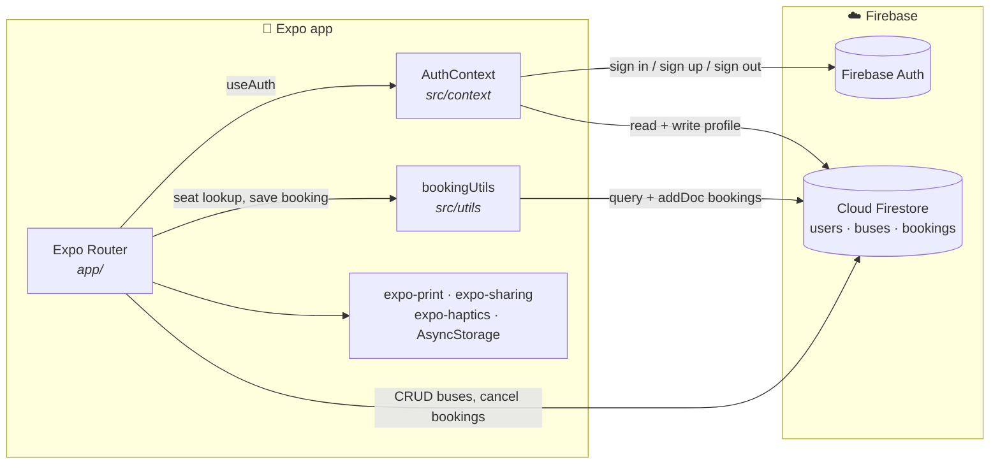
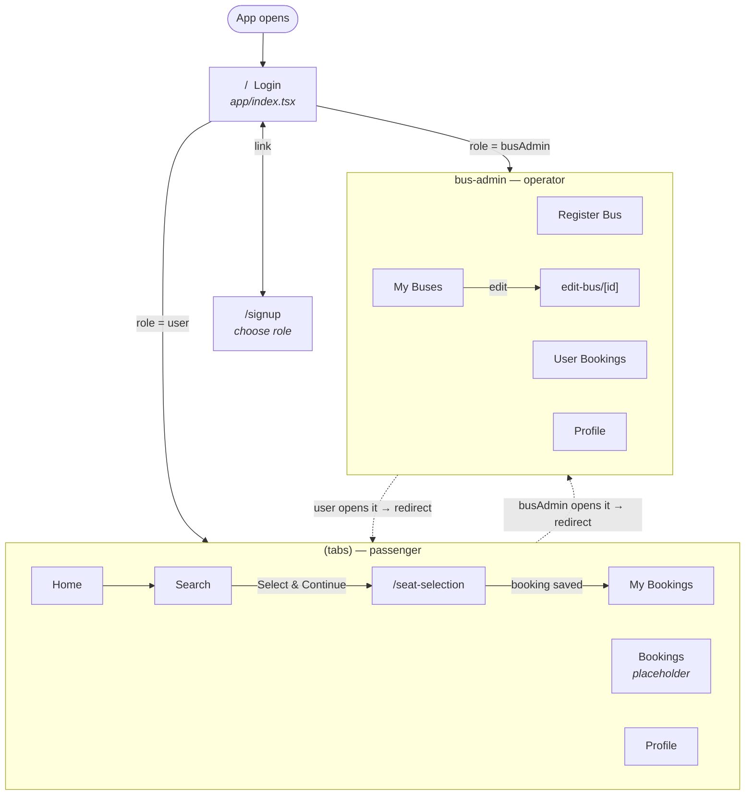
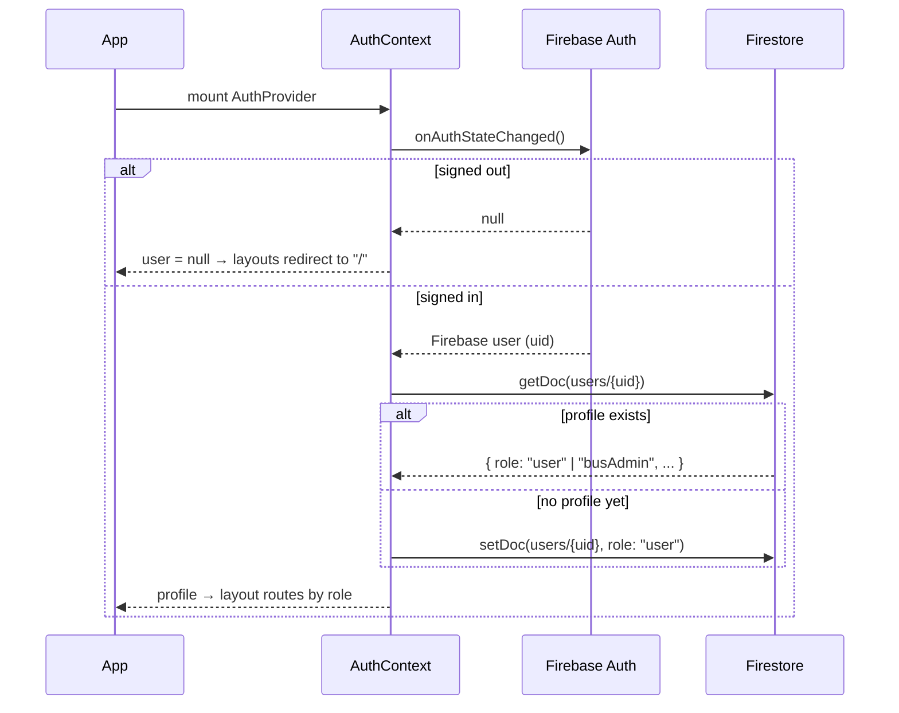
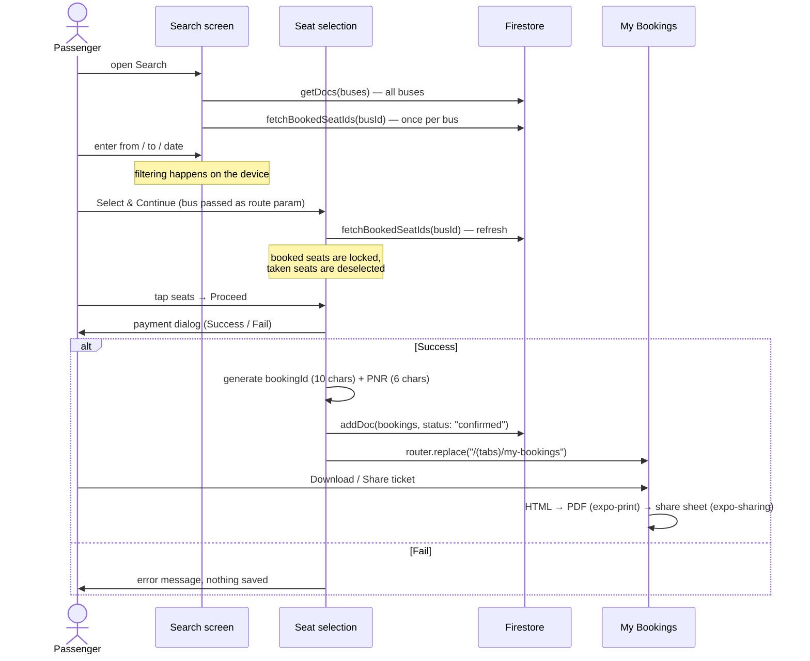
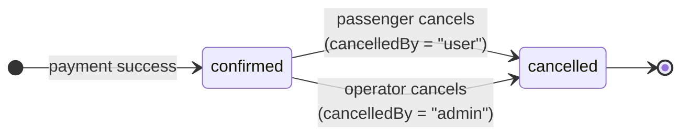
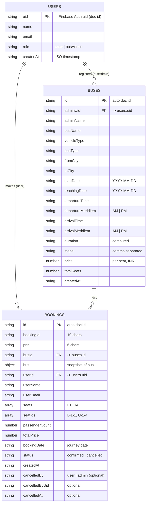

<div align="center">

# 🚌 Go Bus

**A bus ticket booking app for passengers and bus operators, built with Expo + Firebase.**


</div>

---

## Contents

1. [What it does](#1-what-it-does)
2. [Quick start](#2-quick-start)
3. [Architecture](#3-architecture)
4. [Navigation & access control](#4-navigation--access-control)
5. [Booking flow](#5-booking-flow)
6. [Data model](#6-data-model)
7. [Seat layout](#7-seat-layout)
8. [Project structure](#8-project-structure)
9. [Building with EAS](#9-building-with-eas)
10. [Known limitations](#10-known-limitations)
11. [Troubleshooting](#11-troubleshooting)

---

## 1. What it does

Go Bus has **two roles**. You pick a role when you sign up, and the app shows a different set of tabs for each one.

| | 🧑 Passenger (`user`) | 🧑‍✈️ Bus operator (`busAdmin`) |
| :-- | :-- | :-- |
| **Main job** | Find a bus, pick seats, pay, get a ticket | Add buses and manage their bookings |
| **Tabs** | Home · Search · Bookings · My Bookings · Profile | Register Bus · My Buses · User Bookings · Profile |
| **Can create** | Bookings | Buses |
| **Can edit** | Cancel their own booking | Edit or delete their own buses, cancel any booking on their buses |
| **Extras** | Download/share a PDF ticket, haptic feedback | Duration is calculated automatically from departure/arrival times |

---

## 2. Quick start

**Prerequisites:** Node.js 18+ and npm. To run on a phone you need the [Expo Go](https://expo.dev/go) app, or you can use an Android emulator or iOS simulator.

```bash
git clone https://github.com/rizwimohdaltamash/Go-Bus-React-Native.git
cd Go-Bus-React-Native
npm install
npx expo start
```

Then press **`a`** for Android, **`i`** for iOS, or **`w`** for web, or scan the QR code with Expo Go.

### Using your own Firebase project (optional)

The app already points to a Firebase project. To use your own:

1. Create a project in the [Firebase Console](https://console.firebase.google.com/).
2. Turn on **Authentication → Email/Password** and **Cloud Firestore**.
3. Replace the `firebaseConfig` object in [`src/firebase/firebase.ts`](src/firebase/firebase.ts) with your web app config.

> [!NOTE]
> The app reads its config from `src/firebase/firebase.ts`. [`src/firebase/firebaseConfig.js`](src/firebase/firebaseConfig.js) is a duplicate that nothing imports.

### npm scripts

| Command | What it does |
| :-- | :-- |
| `npm start` | Starts the Expo dev server |
| `npm run android` / `npm run ios` | Builds and runs a native development build |
| `npm run web` | Runs the app in a browser |
| `npm run lint` | Runs ESLint (Expo config) |

---

## 3. Architecture

This is a **client-only app with no custom server**. Screens call Firebase directly: Auth for login, and Firestore for all data.



| Layer | Location | Responsibility |
| :-- | :-- | :-- |
| **Screens** | [`app/`](app/) | UI plus most data access (Firestore calls are made inside screens) |
| **Auth** | [`src/context/AuthContext.tsx`](src/context/AuthContext.tsx) | Exposes `user`, `profile`, `signIn`, `signUp`, and `logout` to the whole app |
| **Booking helpers** | [`src/utils/bookingUtils.ts`](src/utils/bookingUtils.ts) | Seat ID mapping, ID/PNR generation, fetching booked seats, saving bookings |
| **Firebase init** | [`src/firebase/firebase.ts`](src/firebase/firebase.ts) | Initializes the app, Auth (session saved in AsyncStorage on native), and Firestore |

---

## 4. Navigation & access control

Routes are file-based ([Expo Router](https://docs.expo.dev/router/introduction/)). Access is enforced in the **layout files**: each tab group checks the user's role and redirects anyone who doesn't belong there.



**How the role is resolved** ([`AuthContext.tsx`](src/context/AuthContext.tsx)):



---

## 5. Booking flow

This is the passenger path, from search to ticket.



### Booking status



A cancelled booking is **kept, not deleted**. Its seats become free again because seat lookups only count `status == "confirmed"`.

---

## 6. Data model

There are three Firestore collections. A booking stores a **copy of the bus details** (`bus`), so its ticket still shows the original information even if the operator edits the bus later.



**Queries used by the app:**

| Screen | Query |
| :-- | :-- |
| Search | `buses` (all docs), then `bookings where busId == X and status == "confirmed"` for each bus |
| My Bookings | `bookings where userId == uid` |
| My Buses / Admin Profile | `buses where adminUid == uid` |
| User Bookings (admin) | `bookings where busId in [...]` (in chunks, because Firestore limits `in` queries) |

---

## 7. Seat layout

Every bus is drawn as **two decks with 18 seats each** (36 seats in total), in rows of 6. The label shown on screen (`L7`) is converted into a grid ID (`L-2-1`), and that ID is what gets stored in `seatIds`:

```
          col 1   col 2   col 3   col 4   col 5   col 6
        ┌───────┬───────┬───────┬───────┬───────┬───────┐
 row 1  │  L1   │  L2   │  L3   │  L4   │  L5   │  L6   │   Lower deck
 row 2  │  L7   │  L8   │  L9   │  L10  │  L11  │  L12  │   (Upper deck is
 row 3  │  L13  │  L14  │  L15  │  L16  │  L17  │  L18  │    identical with "U")
        └───────┴───────┴───────┴───────┴───────┴───────┘

   L7  →  row = ceil(7 / 6) = 2,  col = ((7 − 1) % 6) + 1 = 1  →  "L-2-1"
```

```ts
// src/utils/bookingUtils.ts
export function seatLabelToId(label: string): string {
  const prefix = label[0];
  const num = parseInt(label.slice(1), 10);
  const row = Math.ceil(num / 6);
  const col = ((num - 1) % 6) + 1;
  return `${prefix}-${row}-${col}`;
}
```

A seat shows as **booked** when its ID appears in any confirmed booking for that bus.

---

## 8. Project structure

```text
go-bus/
├── app/                          # Screens (Expo Router — file = route)
│   ├── _layout.tsx               # Root stack, wraps everything in <AuthProvider>
│   ├── index.tsx                 # Login → redirects by role
│   ├── signup.tsx                # Sign up + role picker
│   ├── seat-selection.tsx        # Seat map, payment dialog, saves booking
│   ├── (tabs)/                   # Passenger area (layout blocks busAdmin)
│   │   ├── home.tsx
│   │   ├── search.tsx            # Loads buses, filters by city/date
│   │   ├── booking.tsx           # Placeholder ("coming next")
│   │   ├── my-bookings.tsx       # Ticket list, cancel, PDF share
│   │   └── profile.tsx
│   └── bus-admin/                # Operator area (layout blocks non-admins)
│       ├── index.tsx             # Register bus form
│       ├── my-buses.tsx          # List / delete buses
│       ├── edit-bus/[id].tsx     # Edit a bus
│       ├── admin-bookings.tsx    # Bookings on my buses, cancel
│       └── profile.tsx
│       # register-bus.tsx, user-bookings.tsx, (tabs)/bookings.tsx = legacy redirects
├── src/
│   ├── context/AuthContext.tsx   # Auth state + role
│   ├── firebase/firebase.ts      # Firebase init (config lives here)
│   ├── utils/bookingUtils.ts     # Seat IDs, PNR, fetch/save bookings
│   └── components/RazorpayWebView.tsx   # Razorpay checkout (not wired in yet)
├── components/                   # Shared UI (HapticTab, themed text/view, icons)
├── constants/theme.ts            # Colors
├── hooks/                        # Color scheme helpers
├── app.json                      # Expo config (package: com.altamash_0074.gobus)
└── eas.json                      # EAS build profiles
```

---

## 9. Building with EAS

| Profile | Output | Use it for |
| :-- | :-- | :-- |
| `preview` | `.apk` | Installing directly on Android devices for testing |
| `production` | `.aab` | Uploading to the Google Play Store |

```bash
npm install -g eas-cli
eas login

eas build -p android --profile preview      # APK
eas build -p android --profile production   # AAB
```

---

## 10. Known limitations

These are worth knowing before you extend the app or ship it.

| Area | Current behaviour | Suggested fix |
| :-- | :-- | :-- |
| **Payments** | Checkout is a **simulated** Success/Fail dialog (payment ID `SIM_<timestamp>`). `RazorpayWebView` exists but no screen uses it. | Connect `RazorpayWebView` in `seat-selection.tsx` and verify payments on a server. |
| **Double booking** | Seats are checked when the screen opens, then saved with `addDoc`. Two users can book the same seat at the same moment. | Save the booking inside a Firestore transaction, or add a security rule that checks the seats. |
| **Search** | Downloads **all** buses and runs one bookings query per bus, then filters on the device. | Query with `where('fromCity', '==', …)` and load booked seats only for the chosen bus. |
| **Seat count** | The seat map is always 2 × 18 seats. The `totalSeats` field doesn't change the layout. | Build the grid from `totalSeats` and `busType`. |
| **Security rules** | This repo doesn't include any Firestore rules. | Add `firestore.rules` that enforce roles and ownership. |
| **Bookings tab** | Placeholder screen. | — |

---

## 11. Troubleshooting

| Problem | Fix |
| :-- | :-- |
| Metro shows stale or odd module errors | `npx expo start -c` to clear the cache |
| `permission-denied` from Firestore | Your Firestore rules block the read/write. Check them in the Firebase Console. |
| PDF share does nothing on web | `expo-sharing` isn't supported in most desktop browsers. Test on a device or emulator. |
| Logged in but stuck on the wrong tabs | The role comes from `users/{uid}.role` in Firestore. Check that value. |
| No haptic feedback | Turn on vibration/haptics in the device settings. There is no haptic feedback on web. |
