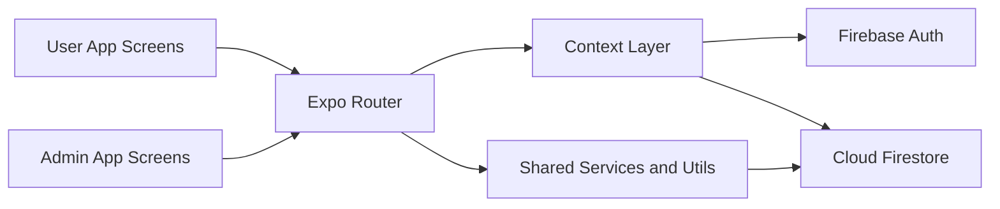

# Go Bus


Go Bus is a mobile-first bus booking platform built with Expo and React Native. It supports both user and bus-admin workflows, including route search, seat booking, booking management, and admin-side bus operations.

## Quick Start (Run In Order)

1. Clone and move into project

```bash
git clone YOUR_GITHUB_REPO_URL
cd go-bus
```

2. Install dependencies

```bash
npm install
```

3. Verify Expo config

```bash
npx expo config --json --type public
```

4. Start development server

```bash
npx expo start
```

5. Run Android locally (optional)

```bash
npx expo run:android
```

6. Build APK with EAS (preview)

```bash
npx eas login
npx eas build -p android --profile preview --non-interactive --clear-cache
```

## Project Summary

Go Bus helps users find and reserve bus seats while giving bus operators an admin interface to register and manage buses. The app is designed around real-time Firestore data, smooth mobile UX, and a clear booking lifecycle (active and cancelled states).

## Core Features

- User authentication using Firebase Auth
- Route and date-based bus search
- Seat map selection with booked-seat blocking
- Booking storage and status updates in Firestore
- Admin portal for bus registration, edit, and monitoring
- Ticket PDF generation and sharing
- Haptics-enhanced interactions for key actions

## Architecture

### High-Level Design



### Layer Breakdown

- Presentation Layer
   - Route-driven screens in `app/` for user and admin flows
   - Reusable UI in `components/`
- Application Layer
   - Auth/session state in `src/context/`
   - Booking helpers in `src/utils/`
- Data Layer
   - Firebase setup in `src/firebase/`
   - Collections for buses, bookings, and users in Firestore

## Folder Structure

```text
go-bus/
   app/                  # File-based routes (user + admin)
   src/
      context/            # Auth and app-level state
      firebase/           # Firebase initialization and config
      utils/              # Booking and helper utilities
      components/         # Shared domain-specific components
   components/           # Generic UI components
   assets/               # Icons, images, static assets
   constants/            # Theme and constants
```

## Tech Stack

- Expo SDK 54
- React Native 0.81
- Expo Router 6
- Firebase (Auth + Firestore)
- TypeScript

## Scripts

```bash
npm start       # Start Expo dev server
npm run android # Run Android
npm run ios     # Run iOS
npm run web     # Run Web
npm run lint    # Lint checks
```

## Build and Release

### Preview APK

```bash
npx eas build -p android --profile preview --non-interactive --clear-cache
```

### Production AAB

```bash
npx eas build -p android --profile production --non-interactive --clear-cache
```

## Environment Notes

- Keep secrets out of source control
- Use EAS environment variables for sensitive values
- Never commit keystore files or private credentials

## Push To GitHub

```bash
git init
git add .
git commit -m "Initial commit: Go Bus"
git branch -M main
git remote add origin YOUR_GITHUB_REPO_URL
git push -u origin main
```

If origin already exists:

```bash
git remote set-url origin YOUR_GITHUB_REPO_URL
git push -u origin main
```

## License

MIT
